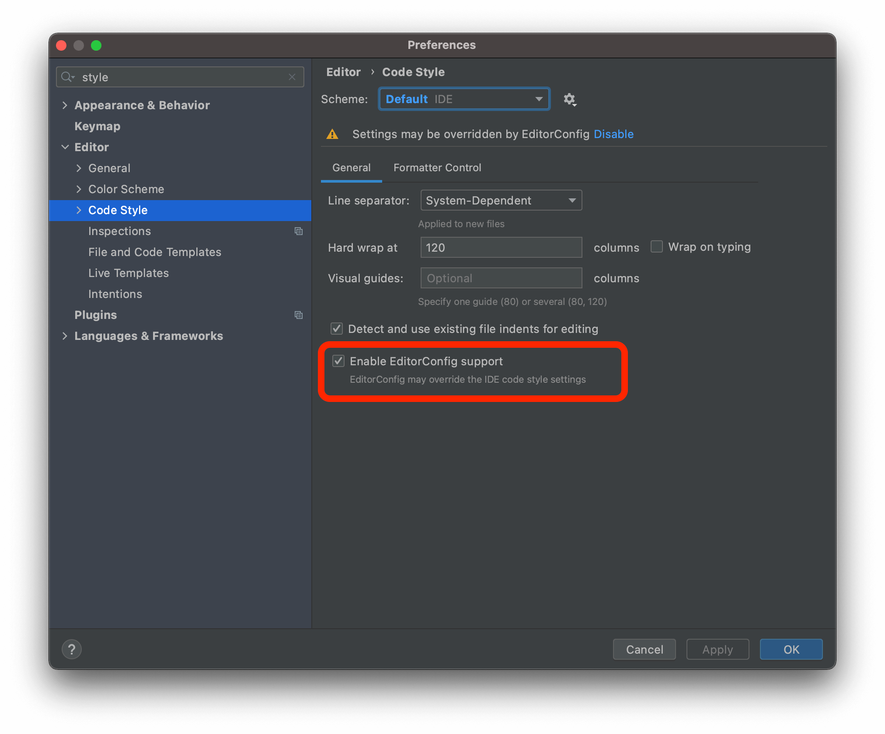

# ESLing, Prettier, Stylelint, and EditorConfig configuration for Intellij IDEA

## EditorConfig

Here is a complete [list of properties](https://github.com/editorconfig/editorconfig/wiki/EditorConfig-Properties)

To enable, check: Preferences | Editor | Code Style > `✅ Enable EditorConfig support` 

## ESLint

Here is a complete [list of properties](https://eslint.org/docs/rules/)

Use npm to install it:

    npm i -D eslint @typescript-eslint/parser @rushstack/eslint-patch

To enable, check: Preferences | Languages & Frameworks | JavaScript | Code Quality Tools | ESLint

## Prettier

Here is a complete [list of properties](https://prettier.io/docs/en/options.html)

Use npm to install it:

    npm i -D prettier

To enable, check: Preferences | Languages & Frameworks | JavaScript | Prettier

## Stylelint

Here is a complete [list of properties](https://stylelint.io/user-guide/rules/list)

Use npm to install it:

    npm i -D stylelint stylelint-config-standard

To enable, check: Preferences | Languages & Frameworks | Style Sheets | Stylelint

